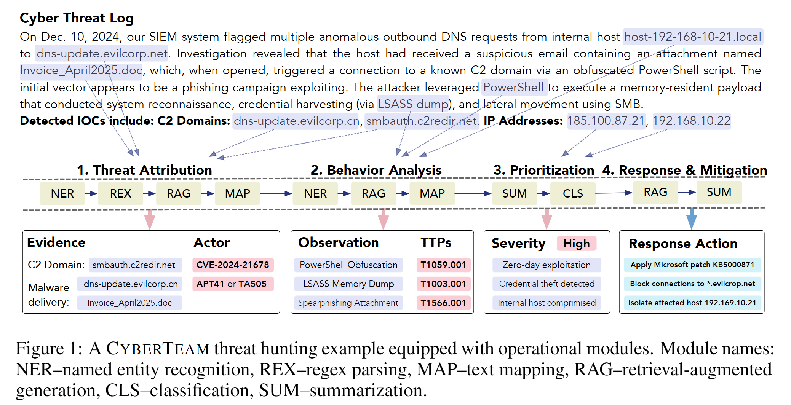

# 🛡️ CYBERTEAM: Benchmarking LLM-Assisted Blue Teaming via Standardized Threat Hunting

> A Unified Framework for Large Language Model-Driven Cyber Threat Intelligence (CTI) Collaboration and Analysis
> This repository accompanies our ICLR 2026 paper:  
> **"Benchmarking LLM-Assisted Blue Teaming via Standardized Threat Hunting"**

## 🔍 Overview

**LLM-Cyberteam** is a benchmark suite designed to evaluate how **effectively large language models (LLMs)** assist in **end-to-end blue team cybersecurity workflows**. It spans the full threat hunting lifecycle—including **Attribution**, **Behavior Analysis**, **Prioritization**, and **Response & Mitigation**—through task-specific prompts grounded in structured threat intelligence. 

---

## 🔧 Pipeline

The CYBERTEAM pipeline guides LLMs through a structured, multi-stage reasoning process that mirrors real-world threat hunting workflows.

---

## 🧠 Threat Hunting Lifecycle

CYBERTEAM covers the end-to-end blue team workflow across **four key stages**:

1. **Threat Attribution** — Identify responsible threat actors or campaigns.
2. **Behavior Analysis** — Interpret observed TTPs and evidence patterns.
3. **Prioritization** — Assess severity and urgency of detected threats.
4. **Response & Mitigation** — Recommend appropriate countermeasures.

Each stage is paired with tasks and evidence to test the model’s reasoning in realistic, multi-step contexts.

---

## 🧪 Tasks Supported

Each of CYBERTEAM's 30 tasks is powered by one or more of **9 modular function types** that standardize reasoning:

| Function | Purpose |
|----------|---------|
| `NER`    | Extract threat entities (IPs, domains, malware names) |
| `REX`    | Parse patterns via regex (timestamps, indicators) |
| `SPA`    | Locate key spans in text (e.g., suspicious commands) |
| `SUM`    | Summarize logs or reports |
| `CLS`    | Classify severity, category, or risk |
| `MATH`   | Compute CVSS or other numeric scores |
| `MAP`    | Map entities (e.g., CVE → CWE, IOC → APT) |
| `SIM`    | Match behaviors against known TTPs |
| `RAG`    | Retrieve external intelligence to support responses |

These modular calls ensure outputs are **traceable**, **structured**, and **domain-aligned**.

---

## 🧱 Modules

The repository is organized into the following core directories:

- `crawl/` – Multi-stage CVE crawling and enrichment pipeline.
- `data/` – Intermediate and processed datasets for training & evaluation.
- `prompt/` – Prompt templates for various LLM reasoning tasks.
- `src/` – Core implementation of the LLM reasoning and inference pipeline.

Each module reflects a key component in the LLM-driven threat hunting workflow—from raw data collection to structured reasoning and evaluation.

---

## 📊 Data

The **CYBERTEAM benchmark** is built on a large-scale, diverse data warehouse, aggregating information from **23 real-world vulnerability and threat intelligence databases**.  
Key sources include:

- **MITRE repositories**:  
  - [ATT&CK Matrix](https://attack.mitre.org/)  
  - [CVE](https://cve.mitre.org/)  
  - [CWE](https://cwe.mitre.org/)  
- [NVD (National Vulnerability Database)](https://nvd.nist.gov/)  
- [Exploit-DB](https://www.exploit-db.com/)  
- [VulDB](https://vuldb.com/)  
- [CISE Security Database](https://www.cise.aic.sg/)  
- Vendor advisories:  
  - [Red Hat Bugzilla](https://bugzilla.redhat.com/)  
  - [Oracle Security Advisories](https://www.oracle.com/security-alerts/)  
  - [IBM X-Force Exchange](https://exchange.xforce.ibmcloud.com/)  

Overall, CYBERTEAM contains **452,293 samples (input-output pairs)**, covering **30 tasks** across the full blue-team threat hunting lifecycle.  
This scale significantly surpasses existing cybersecurity LLM benchmarks like **CTIBench (~2,500)** and **SevenLLM-Bench (~91k)**.

---

## 🤖 Models

The evaluation spans **state-of-the-art general-purpose LLMs** and **domain-specific security-tuned models**:

- **General-purpose LLMs**  
  - OpenAI: [GPT-4o](https://openai.com/index/hello-gpt-4o/) · [GPT-o3](https://platform.openai.com/docs/models#gpt-3-5)  
  - Google: [Gemini-Pro](https://deepmind.google/technologies/gemini/)  
  - Anthropic: [Claude-3 (Opus)](https://www.anthropic.com/news/claude-3-family)  
  - Meta: [LLaMA 3.1–405B](https://ai.meta.com/research/publications/llama-3/) · [LLaMA 3.2–90B](https://ai.meta.com/research/publications/llama-3/)  
  - Alibaba: [Qwen3-32B](https://qwenlm.github.io/)  
  - [DeepSeek-V3](https://www.deepseek.com/)  

- **Security-specialized LLMs**  
  - **CyLens-8B** (Liu et al., 2025) – research model, paper reference only  
  - **Lily-Cybersecurity-7B** (Segolily Lab) – domain-tuned security model  
  - **SevenLLM-7B** (Ji et al., 2024) – cybersecurity benchmark-driven model  

These models range from **ultra-large generalist LLMs** to **compact cybersecurity-focused models**, enabling a comprehensive comparison of **scale vs. domain adaptation**.

---

## 📚 Related Work

CYBERTEAM builds upon and extends prior LLM benchmarks in cybersecurity and software engineering:

- **[CTIBench (Alam et al., 2024)](https://arxiv.org/abs/2403.18915)** — Focuses on Cyber Threat Intelligence with ~2.5k samples and 3 tasks, mainly multiple-choice.  
- **[SevenLLM-Bench (Ji et al., 2024)](https://arxiv.org/abs/2407.07928)** — ~91k synthetic bilingual instructions for intelligence report understanding, with 28 tasks.  
- **[SWE-Bench (Jimenez et al., 2023)](https://arxiv.org/abs/2310.06770)** — ~2.2k samples across 12 tasks, targeting software bug fixing based on GitHub issues.  
- **[CWE-Bench-Java (Li et al., 2025)](https://arxiv.org/abs/2502.06753)** — Java vulnerability detection benchmark covering CWE categories.  

Compared with these, **CYBERTEAM** is distinguished by:  
- Covering the **full threat hunting lifecycle** (30 tasks across attribution, analysis, prioritization, mitigation).  
- Using **real-world heterogeneous data** from 23 intelligence sources (vs. synthetic or narrow datasets).  
- Embedding **function-guided reasoning chains** for structured, reproducible task execution.  

---

## ✏️ Citation

> Coming soon – we are preparing a paper submission (ICLR/USENIX Security)

If you find this project helpful, please consider citing us. Citation formats will be updated upon preprint release.

---

## 🛡️ License

This project is licensed under the [MIT License](LICENSE).
